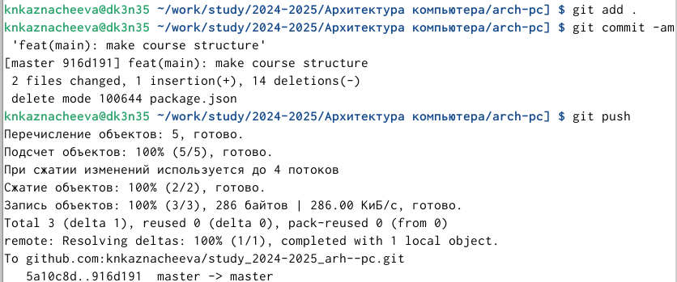

---
## Front matter
title: "Лабораторная работа №2"
subtitle: "Архитектура компьютера"
author: "Казначеева Кристина Никитична"

## Generic otions
lang: ru-RU
toc-title: "Содержание"

## Bibliography
bibliography: bib/cite.bib
csl: pandoc/csl/gost-r-7-0-5-2008-numeric.csl

## Pdf output format
toc: true # Table of contents
toc-depth: 2
fontsize: 12pt
linestretch: 1.5
papersize: a4
documentclass: scrreprt
## I18n polyglossia
polyglossia-lang:
  name: russian
  options:
	- spelling=modern
	- babelshorthands=true
polyglossia-otherlangs:
  name: english
## I18n babel
babel-lang: russian
babel-otherlangs: english
## Fonts
mainfont: IBM Plex Serif
romanfont: IBM Plex Serif
sansfont: IBM Plex Sans
monofont: IBM Plex Mono
mathfont: STIX Two Math
mainfontoptions: Ligatures=Common,Ligatures=TeX,Scale=0.94
romanfontoptions: Ligatures=Common,Ligatures=TeX,Scale=0.94
sansfontoptions: Ligatures=Common,Ligatures=TeX,Scale=MatchLowercase,Scale=0.94
monofontoptions: Scale=MatchLowercase,Scale=0.94,FakeStretch=0.9
mathfontoptions:
## Biblatex
biblatex: true
biblio-style: "gost-numeric"
biblatexoptions:
  - parentracker=true
  - backend=biber
  - hyperref=auto
  - language=auto
  - autolang=other*
  - citestyle=gost-numeric
## Pandoc-crossref LaTeX customization
figureTitle: "Рис."
tableTitle: "Таблица"

## Misc options
indent: true
header-includes:
  - \usepackage{indentfirst}
  - \usepackage{float} # keep figures where there are in the text
  - \floatplacement{figure}{H} # keep figures where there are in the text
---

# Цель работы

Работа направлена на приобретение практических навыков по работе с Git,
включающих в себя понимание принципов работы систем контроля версий и их
практического применения.
# Задание

Лабораторный практикум направлен на получение практических навыков работы с
системой контроля версий Git и платформой GitHub, оптимизацию процессов
разработки кода и обеспечения эффективного взаимодействия совместной работы над
проектами.
В ходе данной лабораторной работы будут освоены настройка github и базовая
настройка git, создание SSH ключа и создание рабочего пространства и репозитория
курса на основе шаблона, а также настройка каталога курса.1

# Выполнение лабораторной работы

Создадим учётную запись на сайте https://github.com/ и заполним основные
данные (рис. [-@fig:101]).

{#fig:101 width=70%}

Сначала сделаем предварительную конфигурацию git. Откроем терминал и введём
следующие команды, указав имя и email владельца репозитория (рис. [-@fig:102]).

{#fig:102 width=70%}

Настроим utf-8 в выводе сообщений git (рис. [-@fig:103]).

{#fig:103 width=70%}

Зададим имя начальной ветки (будем называть её master), затем параметр autocrlf и
параметр safecrlf (/usr/local) (рис. [-@fig:104]).

{#fig:104 width=70%}

Для последующей идентификации пользователя на сервере репозиториев
сгенерируем пару ключей (приватный и открытый) (рис. [-@fig:105]).

{#fig:105 width=70%}

Далее загрузим сгенерённый открытый ключ. Для этого зайдём на сайт
http://github.org/ под своей учётной записью и перейти в меню Setting . После этого
выберем в боковом меню SSH and GPG keys и нажимать кнопку New SSH key .
Скопировав из локальной консоли ключ в буфер обмена (рис. [-@fig:106]).

{#fig:106 width=70%}

Вставим ключ в появившееся на сайте поле и указываем для ключа имя (Title) (рис. [-@fig:107]).

{#fig:107 width=70%}

Для 2024–2025 учебного года и предмета «Архитектура компьютера» (код пред-
мета arch-pc) структура каталогов примет следующий вид:
~/work/study/
└── 2024–2025/
└── Архитектура компьютера/
└── arch-pc/
└── labs/
└── lab01/
└── lab02/
└── lab03/
...
• Каталог для лабораторных работ имеет вид labs.
• Каталоги для лабораторных работ имеют вид lab<номер>, например: lab01, lab02 и
т.д.
Название проекта на хостинге git имеет вид: study_<учебный год>_<код предмета>
Для 2024–2025 учебного года и предмета «Архитектура компьютера» (код предмета
arch-pc) название проекта примет следующий вид: study_2024–2025_arch-pc.
Откроем терминал и создадим каталог для предмета «Архитектура компьютера» (рис. [-@fig:108]).

{#fig:108 width=70%}

Создадим репозиторий на основе шаблона через web-интерфейс github. Для этого
перейдём на станицу репозитория с шаблоном курса
https://github.com/yamadharma/course-directory-student-template (рис. [-@fig:109]).

{#fig:109 width=70%}

В открывшемся окне зададим имя репозитория study_2024–2025_arh-pc и создадим
репозиторий (рис. [-@fig:110]).

{#fig:110 width=70%}

Откроем терминал и перейдём в каталог курса (рис. [-@fig:111]).

{#fig:111 width=70%}

Клонируем созданный репозиторий (рис. [-@fig:112]).

{#fig:112 width=70%}

Перейдём в каталог курса и удалите лишние файлы (рис. [-@fig:113]).

{#fig:113 width=70%}

Создадим необходимые каталоги (рис. [-@fig:114]).

{#fig:114 width=70%}

Отправим файлы на сервер (рис. [-@fig:115]).

{#fig:115 width=70%}

Проверим правильность создания иерархии рабочего пространства в локальном
репозитории и на странице github (рис. [-@fig:116]) и (рис. [-@fig:117]).

{#fig:116 width=70%}

{#fig:117 width=70%}

Создадим отчет по выполнению лабораторной работы в соответствующем каталоге
рабочего пространства (рис. [-@fig:118]).

{#fig:118 width=70%} 

Скопируйте отчеты по выполнению предыдущих лабораторных работ в
соответствующие каталоги созданного рабочего пространства (рис. [-@fig:119]) и (рис. [-@fig:120])

{#fig:119 width=70%}

{#fig:120 width=70%}

Загрузим файлы на github (рис. [-@fig:121]).

{#fig:121 width=70%} 

# Выводы

В ходе лабораторной работы были изучены идеология и применение средств контроля
версий, были приобретены практические навыки по работе с системой git такие, как
создание рабочего пространства и репозитория курса на основе шаблона, создание
SSH ключа, базовая настройка git и настройка github, настройка каталога курса.

