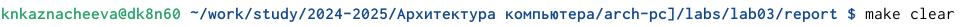

---
## Front matter
title: "Лабораторная работа №3"
subtitle: "Архитектура компьютера"
author: "Казначеева Кристина Никитична"

## Generic otions
lang: ru-RU
toc-title: "Содержание"

## Bibliography
bibliography: bib/cite.bib
csl: pandoc/csl/gost-r-7-0-5-2008-numeric.csl

## Pdf output format
toc: true # Table of contents
toc-depth: 2
fontsize: 12pt
linestretch: 1.5
papersize: a4
documentclass: scrreprt
## I18n polyglossia
polyglossia-lang:
  name: russian
  options:
	- spelling=modern
	- babelshorthands=true
polyglossia-otherlangs:
  name: english
## I18n babel
babel-lang: russian
babel-otherlangs: english
## Fonts
mainfont: IBM Plex Serif
romanfont: IBM Plex Serif
sansfont: IBM Plex Sans
monofont: IBM Plex Mono
mathfont: STIX Two Math
mainfontoptions: Ligatures=Common,Ligatures=TeX,Scale=0.94
romanfontoptions: Ligatures=Common,Ligatures=TeX,Scale=0.94
sansfontoptions: Ligatures=Common,Ligatures=TeX,Scale=MatchLowercase,Scale=0.94
monofontoptions: Scale=MatchLowercase,Scale=0.94,FakeStretch=0.9
mathfontoptions:
## Biblatex
biblatex: true
biblio-style: "gost-numeric"
biblatexoptions:
  - parentracker=true
  - backend=biber
  - hyperref=auto
  - language=auto
  - autolang=other*
  - citestyle=gost-numeric
## Pandoc-crossref LaTeX customization
figureTitle: "Рис."
tableTitle: "Таблица"

## Misc options
indent: true
header-includes:
  - \usepackage{indentfirst}
  - \usepackage{float} # keep figures where there are in the text
  - \floatplacement{figure}{H} # keep figures where there are in the text
---

# Цель работы

Эта работа направлена на развитие навыков оформления структурированных и читаемых отчетов с использованием языка разметки Markdown в соответствии с академическими стандартами.

# Задание

Эта работа посвящена освоению языка разметки Markdown. Markdown - популярный инструмент, который помогает создавать структурированные и легко читаемые документы, особенно в сфере разработки ПО. В рамках этой работы мы освоим: Базовые элементы Markdown: заголовки, абзацы, списки, ссылки, изображения. Форматирование текста: подчеркивание, курсив, жирный шрифт. Вставку формул: использование LaTeX-подобного синтаксиса для вставки математических формул. Обработку файлов: работу с файлами в формате Markdown, включая их создание, редактирование и сохранение. По окончании работы вы сможете создавать качественную документацию к программному обеспечению, а также вести заметки, писать статьи и другие текстовые материалы, используя преимущества Markdown.

# Выполнение лабораторной работы

Открываем терминал, затем переходим в сформированный при выполнении лабораторной работы №2 каталог курса. 

{#fig:101 width=70%}

Обновляем локальный репозиторий, скачивая изменения из удаленного репозитория с помощью командыт git pull (рис. [-@fig:102]).

{#fig:102 width=70%}

Переходим в каталог с шаблоном отчета по лабораторной работе № 3 и проводим компиляцию шаблона с использованием Makefile, вводя команду make (рис. [-@fig:103]).

{#fig:103 width=70%}

Удаляем файлы report.pdf и report.docx, полученные с использованием Makefile (рис. [-@fig:104]).

{#fig:104 width=70%}

Открываем файл report.md c помощью любого текстового редактора и заполняем отчет (рис. [-@fig:105]).

{#fig:105 width=70%}

В соответствующем каталоге сделаем отчёт по лабораторной работе № 2 в формате Markdown (рис. [-@fig:106]).

{#fig:106 width=70%}

Загружаем файлы на Github (рис. [-@fig:107]).

{#fig:107 width=70%}

# Выводы

Мы успешно освоили основы языка разметки Markdown во время лабораторной работы. Было освоено создание заголовков, абзацев, списков, ссылков, изображений, а также форматирование текста, вставление формулы и работа с файлами в формате Markdown. 

Эти навыки позволяют создавать качественную текстовую документацию, которая пригодится нам в будущих проектах.

