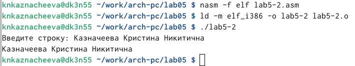

---
## Front matter
title: "Лабораторная работа №5"
subtitle: "Архитектура компьютера"
author: "Казначеева Кристина Никитична"

## Generic otions
lang: ru-RU
toc-title: "Содержание"

## Bibliography
bibliography: bib/cite.bib
csl: pandoc/csl/gost-r-7-0-5-2008-numeric.csl

## Pdf output format
toc: true # Table of contents
toc-depth: 2
fontsize: 12pt
linestretch: 1.5
papersize: a4
documentclass: scrreprt
## I18n polyglossia
polyglossia-lang:
  name: russian
  options:
	- spelling=modern
	- babelshorthands=true
polyglossia-otherlangs:
  name: english
## I18n babel
babel-lang: russian
babel-otherlangs: english
## Fonts
mainfont: IBM Plex Serif
romanfont: IBM Plex Serif
sansfont: IBM Plex Sans
monofont: IBM Plex Mono
mathfont: STIX Two Math
mainfontoptions: Ligatures=Common,Ligatures=TeX,Scale=0.94
romanfontoptions: Ligatures=Common,Ligatures=TeX,Scale=0.94
sansfontoptions: Ligatures=Common,Ligatures=TeX,Scale=MatchLowercase,Scale=0.94
monofontoptions: Scale=MatchLowercase,Scale=0.94,FakeStretch=0.9
mathfontoptions:
## Biblatex
biblatex: true
biblio-style: "gost-numeric"
biblatexoptions:
  - parentracker=true
  - backend=biber
  - hyperref=auto
  - language=auto
  - autolang=other*
  - citestyle=gost-numeric
## Pandoc-crossref LaTeX customization
figureTitle: "Рис."
tableTitle: "Таблица"

## Misc options
indent: true
header-includes:
  - \usepackage{indentfirst}
  - \usepackage{float} # keep figures where there are in the text
  - \floatplacement{figure}{H} # keep figures where there are in the text
---

# Цель работы

Целью лабораторной работы является приобретение практических навыков использования файлового менеджера Midnight Commander и освоение основных инструкций языка ассемблера "mov" и "int".

# Задание

Эта лабораторная работа направлена на освоение программ, выводящих сообщение на экран и считывающих ввод с клавиатуры. Мы познакомимся с двумя вариантами:
• Программирование с использованием файла in_out.asm: изучение принципов подключения внешнего файла с готовыми функциями ввода/вывода.
• Программирование без внешнего файла: реализация функции вывода и ввода, используя системные вызовы.

# Выполнение лабораторной работы

Открываем Midnight Commander
(рис. [-@fig:001]).

{#fig:001 width=70%}
	
Перейдём в каталог ~/work/arch-pc, созданный при выполнении лабораторной работы №4 (рис. [-@fig:002]).

{#fig:002 width=70%}

Создаём папку lab05 и переходим в созданный каталог,затем. пользуясь строкой ввода и командой touch, создаём файл lab5-1.asm (рис. [-@fig:003]).

{#fig:003 width=70%}

Открываем файл lab5-1.asm для редактирования во встроенном редакторе и вводим текст программы  (рис. [-@fig:004]).

{#fig:004 width=70%}

Открываем файл lab5-1.asm для просмотра, чтобы убедидиться, что файл содержит текст программы(рис. [-@fig:005]).

{#fig:005 width=70%}

Оттранслируем текст программы lab5-1.asm в объектный файл и выполним компоновку объектного файла, затем запустим получившийся исполняемый файл. Программа выводит строку 'Введите строку:' и ожидает ввода с клавиатуры (рис. [-@fig:006]).

{#fig:006 width=70%}

В одной из панелей mc открываем каталог с файлом lab5-1.asm. В другой панели каталог со скаченным файлом in_out.asm. Скомпилируем файл in_out.asm в каталог с файлом lab5-1.asm (рис. [-@fig:007]).

{#fig:007 width=70%}

Создаём копию файла lab5-1.asm с именем lab5-2.asm (рис. [-@fig:008]):

{#fig:008 width=70%}

Исправляем текст программы в файле lab5-2.asm с использованием подпрограмм из внешнего файла in_out.asm и создаём исполняемый файл (рис. [-@fig:009]).

{#fig:009 width=70%}

Проверяем работу файла (рис. [-@fig:010]).

{#fig:010 width=70%}

В файле lab5-2.asm заменяем подпрограмму sprintLF на sprint и создаём исполняемый файл (рис. [-@fig:011]).

{#fig:011 width=70%}

Проверяем работу файла (рис. [-@fig:012]).

{#fig:012 width=70%}

Создаём копию файла lab5-1.asm и вносим изменения в программу (без использования внешнего файла in_out.asm), так чтобы она работала по следующему алгоритму:
• вывести приглашение типа “Введите строку:”;
• ввести строку с клавиатуры;
• вывести введённую строку на экран (рис. [-@fig:013]).

{#fig:013 width=70%}

Создаём копию файла lab5-2.asm и исправляем текст программы с использование подпрограмм из внешнего файла in_out.asm, так чтобы она работала по следующему
алгоритму:
• вывести приглашение типа “Введите строку:”;
• ввести строку с клавиатуры;
• вывести введённую строку на экран (рис. [-@fig:014]).

{#fig:014 width=70%}

# Выводы

В ходе работы мы успешно освоили несколько ключевых навыков:

1. Работа с файловым менеджером: 
Мы получили практический опыт работы с Midnight Commander, научились эффективно управлять файлами и директориями.

2. Основы ассемблера: 
Мы изучили основные инструкции языка ассемблера "mov" и "int", что позволяет нам перемещать данные в регистры и вызывать системные функции.

3. Программирование ввода/вывода:
Мы освоили создание программ, которые выводят сообщения на экран и считывают данные с клавиатуры. 

4. Подключение внешних файлов:
Мы познакомились с двумя подходами к реализации функций ввода/вывода:
• Использование готового кода: Мы изучили принципы подключения внешнего файла in_out.asm, который предоставляет готовые функции ввода/вывода.
• Самостоятельная реализация: Мы освоили необходимые системные вызовы, чтобы самостоятельно реализовать функции ввода/вывода.

В целом, мы получили ценный практический опыт в работе с ассемблером и файловым менеджером Midnight Commander, что позволит нам уверенно решать разнообразные задачи в будущем.
