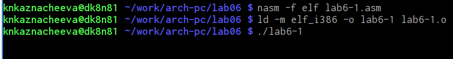
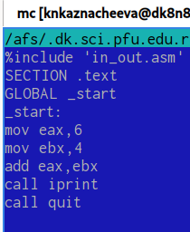

---
## Front matter
title: "Лабораторная работа №6"
subtitle: "Архитектура компьютера"
author: "Казначеева Кристина Никитична"

## Generic otions
lang: ru-RU
toc-title: "Содержание"

## Bibliography
bibliography: bib/cite.bib
csl: pandoc/csl/gost-r-7-0-5-2008-numeric.csl

## Pdf output format
toc: true # Table of contents
toc-depth: 2
fontsize: 12pt
linestretch: 1.5
papersize: a4
documentclass: scrreprt
## I18n polyglossia
polyglossia-lang:
  name: russian
  options:
	- spelling=modern
	- babelshorthands=true
polyglossia-otherlangs:
  name: english
## I18n babel
babel-lang: russian
babel-otherlangs: english
## Fonts
mainfont: IBM Plex Serif
romanfont: IBM Plex Serif
sansfont: IBM Plex Sans
monofont: IBM Plex Mono
mathfont: STIX Two Math
mainfontoptions: Ligatures=Common,Ligatures=TeX,Scale=0.94
romanfontoptions: Ligatures=Common,Ligatures=TeX,Scale=0.94
sansfontoptions: Ligatures=Common,Ligatures=TeX,Scale=MatchLowercase,Scale=0.94
monofontoptions: Scale=MatchLowercase,Scale=0.94,FakeStretch=0.9
mathfontoptions:
## Biblatex
biblatex: true
biblio-style: "gost-numeric"
biblatexoptions:
  - parentracker=true
  - backend=biber
  - hyperref=auto
  - language=auto
  - autolang=other*
  - citestyle=gost-numeric
## Pandoc-crossref LaTeX customization
figureTitle: "Рис."
tableTitle: "Таблица"

## Misc options
indent: true
header-includes:
  - \usepackage{indentfirst}
  - \usepackage{float} # keep figures where there are in the text
  - \floatplacement{figure}{H} # keep figures where there are in the text
---

# Цель работы

В рамках лабораторной работы мы изучим арифметические инструкции языка ассемблера NASM, чтобы в дальнейшем научиться решать простые арифметические задачи с помощью ассемблера.

# Задание

В этой лабораторной работе мы познакомимся с основными типами данных в ассемблере NASM, освоим выполнение арифметических операций, научимся выводить значения регистров на экран и напишем программу для вычисления арифметических выражений.

# Выполнение лабораторной работы

Создадим каталог и перейдём в него, затем создадим файл lab6-1.asm:
(рис. [-@fig:001]).

{#fig:001 width=70%}
	
Вводим в файл lab6-1.asm текст программы вывода значения регистра eax (рис. [-@fig:002]).

{#fig:002 width=70%}

Создаём исполняемый файл и запускаем его (рис. [-@fig:003]).

{#fig:003 width=70%}

Далее изменим текст программы и вместо символов, запишем в регистры числа (рис. [-@fig:004]).

{#fig:004 width=70%}

Создадим исполняемый файл и запустим его (рис. [-@fig:005]).

{#fig:005 width=70%}

Создаём файл lab6-2.asm в каталоге ~/work/arch-pc/lab06 (рис. [-@fig:006]).

{#fig:006 width=70%}

Вводим в него текст программы вывода значения регистра eax (рис. [-@fig:007]).

{#fig:007 width=70%}

Создаём исполняемый файл и запускаем его (рис. [-@fig:008]):

{#fig:008 width=70%}

Далее заменяем текст программы и вместо символов, записываем в регистры числа (рис. [-@fig:009]).

{#fig:009 width=70%}

Создаём исполняемый файл и запускаем его (рис. [-@fig:010]).

{#fig:010 width=70%}

Заменяем функцию iprintLF на iprint (рис. [-@fig:011]).

{#fig:011 width=70%}

При замене функции iprintLF на iprint сообщение выводится в одну строку (рис. [-@fig:012]).

{#fig:012 width=70%}

Создаём файл lab6-3.asm в каталоге ~/work/arch-pc/lab06 (рис. [-@fig:013]).

{#fig:013 width=70%}

Вводим в файл lab6-3.asm текст программы вычисления выражения  f(x) = (5 ∗ 2 + 3)/3 (рис. [-@fig:014]).

{#fig:014 width=70%}

Создаём исполняемый файл и запускаем его (рис. [-@fig:015]).

{#fig:015 width=70%} 

Измените текст программы для вычисления выражения f(x) = (4 ∗ 6 + 2)/5 (рис. [-@fig:016]).

{#fig:016 width=70%} 

Создаём исполняемый файл и проверяем его работу (рис. [-@fig:017]).

{#fig:017 width=70%}

Создаём файл variant.asm в каталоге ~/work/arch-pc/lab06, (рис. [-@fig:018]).

{#fig:018 width=70%} 

Затем вводим в него текст программы вычисления варианта задания по номеру студенческого билета (рис. [-@fig:019]).

{#fig:019 width=70%}

Создаём исполняемый файл и запускаем его, затем проверим результат работы программы, вычислив номер варианта аналитически (рис. [-@fig:020]).

{#fig:020 width=70%}

1. Какие строки листинга 6.4 отвечают за вывод на экран сообщения ‘Ваш вариант:’?
• mov eax, rem: Эта строка загружает адрес сообщения "Ваш вариант:" (которое находится в переменной rem) в регистр eax.
• call sprint: Эта строка вызывает функцию sprint, которая выводит строку, адрес которой находится в eax.
Таким образом, эти две строки совместно выводят на экран сообщение "Ваш вариант:".

2. Для чего используется следующие инструкции?
• mov ecx, x: Эта инструкция загружает адрес буфера x в регистр ecx. Регистр ecx используется в системе вызовов для указания адреса буфера, куда будет записана введенная строка. 
• mov edx, 80: Эта инструкция загружает значение 80 в регистр edx. Регистр edx указывают максимальную длину вводимой строки (80 байт). 
• call sread: Эта инструкция вызывает функцию sread. Функция sread - это внешняя функция, которая занимается считыванием данных с клавиатуры. Функция sread использует значения из ecx (адрес буфера) и edx (максимальная длина) для корректного ввода и записи данных в буфер x.

3. Для чего используется инструкция “call atoi”?
Инструкция call atoi используется для преобразования строки ASCII-символов в целое число. 

4. Какие строки листинга 6.4 отвечают за вычисления варианта?
Строки, которые отвечают за вычисление варианта, это:
  xor edx, edx ; Обнуляем EDX для div
  mov ebx, 20
  div ebx ; eax = x / 20, edx = x % 20
  inc edx ; edx = (x % 20) + 1

5. В какой регистр записывается остаток от деления при выполнении инструкции “div ebx”?
Остаток от деления при выполнении инструкции div ebx записывается в регистр edx.

6. Для чего используется инструкция “inc edx”?
Инструкция inc edx увеличивает значение в регистре edx на 1. В данной программе она используется, чтобы вариант студента был в диапазоне от 1 до 20, а не от 0 до 19.

7. Какие строки листинга 6.4 отвечают за вывод на экран результата вычислений?
За вывод результата вычислений отвечают следующие строки:
  mov eax, rem
  call sprint
  mov eax, edx
  call iprintLF 

Создадим файл lab6-4.asm и напишем программу вычисления выражения для 14 варианта: y(x)=( x/2 + 8) ⋅ 3 (рис. [-@fig:021]).

{#fig:021 width=70%}

Создаём исполняемый файл и
проверяем его работу для значения x1 = 1 (рис. [-@fig:022]).

{#fig:022 width=70%}

Затем проверяем работу файла для значения x2 = 4 (рис. [-@fig:023])

{#fig:023 width=70%}

# Вывод

 В ходе лабораторной работы мы получили практические навыки работы с ассемблером NASM: освоили типы данных, арифметические операции, вывод данных на экран и реализовали программу для вычисления выражений.
