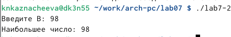

---
## Front matter
title: "Лабораторная работа №7"
subtitle: "Архитектура компьютера"
author: "Казначеева Кристина Никитична"

## Generic otions
lang: ru-RU
toc-title: "Содержание"

## Bibliography
bibliography: bib/cite.bib
csl: pandoc/csl/gost-r-7-0-5-2008-numeric.csl

## Pdf output format
toc: true # Table of contents
toc-depth: 2
fontsize: 12pt
linestretch: 1.5
papersize: a4
documentclass: scrreprt
## I18n polyglossia
polyglossia-lang:
  name: russian
  options:
	- spelling=modern
	- babelshorthands=true
polyglossia-otherlangs:
  name: english
## I18n babel
babel-lang: russian
babel-otherlangs: english
## Fonts
mainfont: IBM Plex Serif
romanfont: IBM Plex Serif
sansfont: IBM Plex Sans
monofont: IBM Plex Mono
mathfont: STIX Two Math
mainfontoptions: Ligatures=Common,Ligatures=TeX,Scale=0.94
romanfontoptions: Ligatures=Common,Ligatures=TeX,Scale=0.94
sansfontoptions: Ligatures=Common,Ligatures=TeX,Scale=MatchLowercase,Scale=0.94
monofontoptions: Scale=MatchLowercase,Scale=0.94,FakeStretch=0.9
mathfontoptions:
## Biblatex
biblatex: true
biblio-style: "gost-numeric"
biblatexoptions:
  - parentracker=true
  - backend=biber
  - hyperref=auto
  - language=auto
  - autolang=other*
  - citestyle=gost-numeric
## Pandoc-crossref LaTeX customization
figureTitle: "Рис."
tableTitle: "Таблица"

## Misc options
indent: true
header-includes:
  - \usepackage{indentfirst}
  - \usepackage{float} # keep figures where there are in the text
  - \floatplacement{figure}{H} # keep figures where there are in the text
---

# Цель работы

Лабораторная работа направлена на рассматрение команды условного и безусловного перехода, формирование навыков написания программ с использованием переходов, а также на знакомство с назначением и структурой файла листинга.

# Задание

В данной лабораторной работе мы изучим безусловные переходы (jmp) и программу поиска наибольшего из трёх целых чисел. Также мы рассмотрим структуру файлов листинга и реализацию переходов в NASM.

# Выполнение лабораторной работы

Создадим каталог lab07 и перейдём в него (рис. [-@fig:001]).

{#fig:001 width=70%}
	
Затем создадим файл lab7-1.asm (рис. [-@fig:002]).

{#fig:002 width=70%}

Введём в файл lab7-1.asm текст программы с использованием инструкции jmp (рис. [-@fig:003]).

{#fig:003 width=70%}

Создадим исполняемый файл и запустим его (рис. [-@fig:004]).
	
{#fig:004 width=70%}

Инструкция jmp позволяет осуществлять переходы не только вперед но и назад. Изменим текст программы таким образом, чтобы она выводила сначала ‘Сообщение № 2’, потом ‘Сообщение№ 1’ и завершала работу (рис. [-@fig:005]).

{#fig:005 width=70%}

Запустим исполняемый файл его (рис. [-@fig:006]).

{#fig:006 width=70%}

Создадим файл lab7-2.asm в каталоге ~/work/arch-pc/lab07 (рис. [-@fig:007]).

{#fig:007 width=70%}

Введём в файл lab7-2.asm программу, которая определяет и выводит на экран наибольшую из 3 целочисленных переменных: A,B и C (рис. [-@fig:008]):

{#fig:008 width=70%}

Создадим исполняемый файл и проверим его работу, например, для значения B = 98 (рис. [-@fig:009]).

{#fig:009 width=70%}

Чтобы получить файл листинга, создадим файл листинга для программы из файла lab7-2.asm, указав ключ -l и задав имя файла листинга в командной строке (рис. [-@fig:010]).

{#fig:010 width=70%}

Откроем файл листинга lab7-2.lst с помощью mcedit (рис. [-@fig:011]).

{#fig:011 width=70%}

В содержимом листинга можно увидеть построчное отображение ассемблерного кода и соответствующего машинного кода, сгенерированного ассемблером. Файл листинга содержит: адреса (адреса памяти, где располагается каждая инструкция), машинный код, шестнадцатеричный (фактические машинные инструкции, сгенерированные ассемблером, отображаются в шестнадцатеричном формате) и символьную информацию (информация о символах (метках, переменных), используемых в вашем коде) (рис. [-@fig:012]).

{#fig:012 width=70%}

Откроем файл с программой lab7-2.asm и в любой инструкции с двумя операндами
удалим один операнд, затем выполним трансляцию с получением файла листинга.
Удаление операнда из инструкции с двумя операндами создаёт синтаксическую ошибку, которую ассемблер не может разрешить. Процесс сборки завершится неудачей, что предотвратит создание объектного файла, но файл листинга всё равно будет сгенерирован с сообщениями об ошибках, указывающими на проблему (рис. [-@fig:013]).

{#fig:013 width=70%}

Создадим файл lab7-3.asm (рис. [-@fig:014]).

{#fig:014 width=70%}

Напишем в полученом файле программу нахождения наименьшей из 3 целочисленных переменных a, b и c для варианта 14 (рис. [-@fig:015]).

{#fig:015 width=70%} 

Cоздадим исполняемый файл и проверим его работу (рис. [-@fig:016]).

{#fig:016 width=70%} 

Создадим файл lab7-4.asm (рис. [-@fig:017]).

{#fig:017 width=70%}

Напишем в полученном файле программу (вариант 14), которая для введенных с клавиатуры значений x и a вычисляет значение заданной функции f(x) и выводит результат вычислений (рис. [-@fig:018]).

{#fig:018 width=70%} 

Создадим исполняемый файл и проверим его работу для значений x и a, сначала для x=2 и a=3 (рис. [-@fig:019]).

{#fig:019 width=70%}

Затем проверим работу исполняемого файла для значений x=4 и a=2 (рис. [-@fig:020]).

{#fig:020 width=70%}

# Вывод

В рамках лабораторной работы были изучены команды условного и безусловного перехода, структура файлов листинга и особенности реализации переходов в среде NASM. Были получены практические навыки написания программ с использованием переходов.
