---
## Front matter
title: "Лабораторная работа №8"
subtitle: "Архитектура компьютера"
author: "Казначеева Кристина Никитична"

## Generic otions
lang: ru-RU
toc-title: "Содержание"

## Bibliography
bibliography: bib/cite.bib
csl: pandoc/csl/gost-r-7-0-5-2008-numeric.csl

## Pdf output format
toc: true # Table of contents
toc-depth: 2
fontsize: 12pt
linestretch: 1.5
papersize: a4
documentclass: scrreprt
## I18n polyglossia
polyglossia-lang:
  name: russian
  options:
	- spelling=modern
	- babelshorthands=true
polyglossia-otherlangs:
  name: english
## I18n babel
babel-lang: russian
babel-otherlangs: english
## Fonts
mainfont: IBM Plex Serif
romanfont: IBM Plex Serif
sansfont: IBM Plex Sans
monofont: IBM Plex Mono
mathfont: STIX Two Math
mainfontoptions: Ligatures=Common,Ligatures=TeX,Scale=0.94
romanfontoptions: Ligatures=Common,Ligatures=TeX,Scale=0.94
sansfontoptions: Ligatures=Common,Ligatures=TeX,Scale=MatchLowercase,Scale=0.94
monofontoptions: Scale=MatchLowercase,Scale=0.94,FakeStretch=0.9
mathfontoptions:
## Biblatex
biblatex: true
biblio-style: "gost-numeric"
biblatexoptions:
  - parentracker=true
  - backend=biber
  - hyperref=auto
  - language=auto
  - autolang=other*
  - citestyle=gost-numeric
## Pandoc-crossref LaTeX customization
figureTitle: "Рис."
tableTitle: "Таблица"

## Misc options
indent: true
header-includes:
  - \usepackage{indentfirst}
  - \usepackage{float} # keep figures where there are in the text
  - \floatplacement{figure}{H} # keep figures where there are in the text
---

# Цель работы

Лабораторная работа направлена на практическое освоение программирования с использованием циклов и обработки аргументов командной строки.

# Задание

В данной лабораторной работе мы изучим реализацию циклов в NASM, программы вывода значений регистра ecx и вычисления суммы аргументов командной строки, а также программу, выводящую на экран аргументы командной строки. Научимся обработке аргументов командной строки.

# Выполнение лабораторной работы

Создадим каталог lab08 (рис. [-@fig:001]).

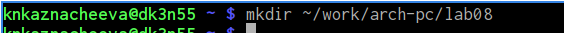{#fig:001 width=70%}
	
Перейдём в этот каталог и создадим файл lab8-1.asm (рис. [-@fig:002]).

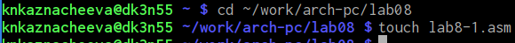{#fig:002 width=70%}

Введём в файл lab8-1.asm текст программу вывода значений регистра ecx (рис. [-@fig:003]).

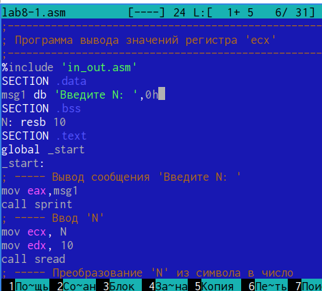{#fig:003 width=70%}

Создадим исполняемый файл и запустим его (рис. [-@fig:004]).
	
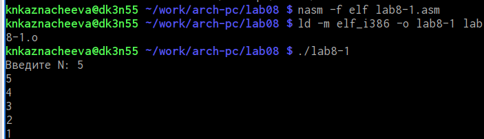{#fig:004 width=70%}

Затем изменим текст программы, добавив изменение значение регистра ecx в цикле (рис. [-@fig:005]).

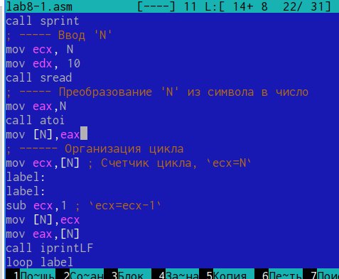{#fig:005 width=70%}

Запустим исполняемый файл и проверим его. Регистр ecx принимает в цикле значения, уменьшающиеся на 1 на каждой итерации цикла, начиная с начального значения, которое задано до начала цикла. Число проходов цикла точно соответствует значению N, которое было загружено в ecx до начала цикла. Цикл выполняется N раз( (рис. [-@fig:006]).

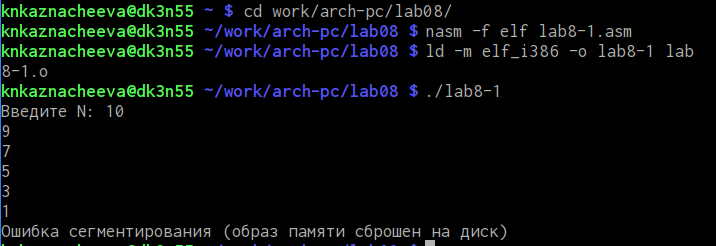{#fig:006 width=70%}

Внесём изменения в текст программы, добавив команды push и pop (добавления в стек и извлечения из стека) для сохранения значения счетчика цикла loop (рис. [-@fig:007]).

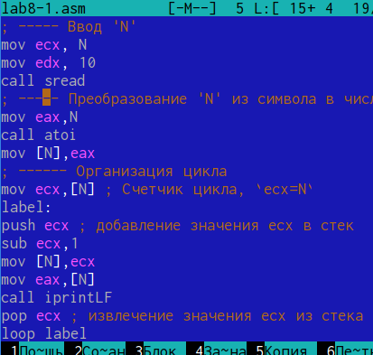{#fig:007 width=70%}

Создадим исполняемый файл и проверим его работу. При добавлении команды push
и pop число проходов цикла в измененном коде не будет точно соответствовать значению N, введенному с клавиатуры. (рис. [-@fig:008]):

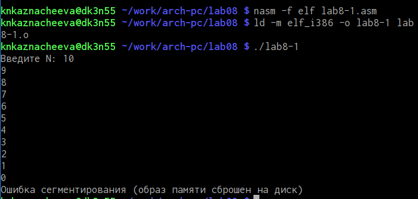{#fig:008 width=70%}

Создадим файл lab8-2.asm в каталоге ~/work/arch-pc/lab08 (рис. [-@fig:009]).

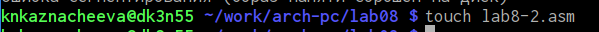{#fig:009 width=70%}

Введём в него текст программы, выводящей на экран аргументы командной строки (рис. [-@fig:010]).

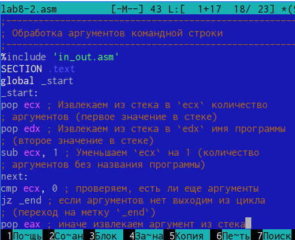{#fig:010 width=70%}

Создадим исполняемый файл и запустим его, указав аргументы: аргумент1 аргумент 2 'аргумент 3'. В результате было обработано 3 аргумента (рис. [-@fig:011]).

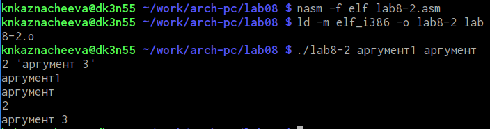{#fig:011 width=70%}

Создадим файл lab8-3.asm в каталоге ~/work/arch-pc/lab08 (рис. [-@fig:012]).

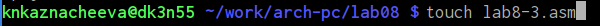{#fig:012 width=70%}

Ведём в него текст программы вычисления суммы аргументов командной строки (рис. [-@fig:013]).

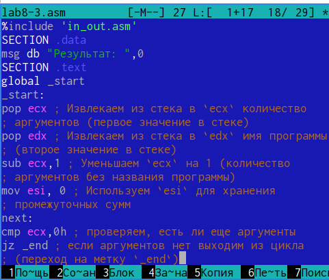{#fig:013 width=70%}

Создадим исполняемый файл и запустим его, указав аргументы (рис. [-@fig:014]).

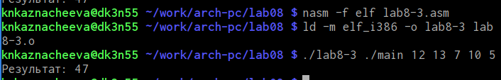{#fig:014 width=70%}

Изменим текст программы для вычисления произведения аргументов командной строки (рис. [-@fig:015]).

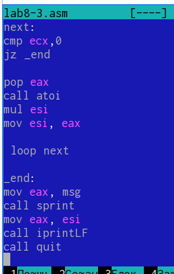{#fig:015 width=70%} 

Cоздадим исполняемый файл и проверим его работу (рис. [-@fig:016]).

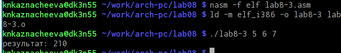{#fig:016 width=70%} 

Создадим файл lab8-4.asm (рис. [-@fig:017]).

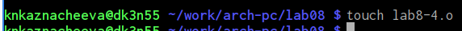{#fig:017 width=70%}

Напишем программу, которая находит сумму значений функции f(x)=7(x+1) (вариант 14) для x = x1, x2, ..., xn, т.е. программа должна выводить значение f(x1) + f(x2) + ... + f(x3), где значения x передаются как аргументы (рис. [-@fig:018]).

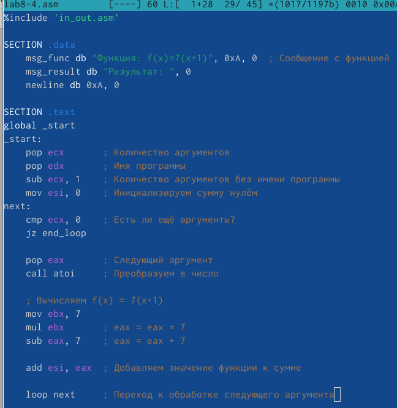{#fig:018 width=70%} 

Создадим исполняемый файл и проверим его работу для значений x: 1, 2, 3, 4 (рис. [-@fig:019]).

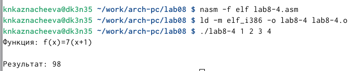{#fig:019 width=70%}

1. Команда loop реализует цикл, который повторяется ecx раз. Она выполняет три действия:
• Уменьшает значение регистра ecx на 1.  Регистр ecx обычно используется как счетчик цикла.
• Проверяет значение регистра ecx. Если ecx не равно нулю, то происходит переход к указанной метке.
• Переход к метке. Если ecx не равно нулю, выполнение переходит к метке, указанной после команды loop.  Если ecx равно нулю, выполнение продолжается с инструкции, следующей за командой loop.
2. Для организации цикла без использования специальных команд управления циклами, таких как loop, используются условные переходы, например, jnz (jump if not zero) или jz (jump if zero).
3. Стек — это структура данных типа LIFO (Last-In, First-Out — последний вошел, первый вышел). В программировании стек используется для временного хранения данных, например, адресов возврата при вызовах функций, локальных переменных и промежуточных результатов вычислений.
4. Данные извлекаются из стека в порядке, обратном порядку их занесения (LIFO).  Последний элемент, добавленный в стек (то есть, находящийся на вершине стека), является первым элементом, который будет извлечен.  Операции добавления и извлечения данных в стеке часто называются push (добавление) и pop (извлечение).

# Вывод

В ходе лабораторной работы мы изучили программирование на ассемблере NASM, освоив работу с циклами и обработку аргументов командной строки. Мы реализовали примеры программ: вывод значения регистра ECX, вычисление суммы числовых аргументов командной строки и вывод самих аргументов на экран.
