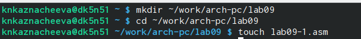
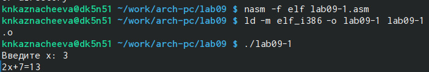
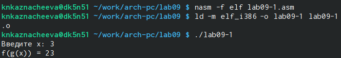
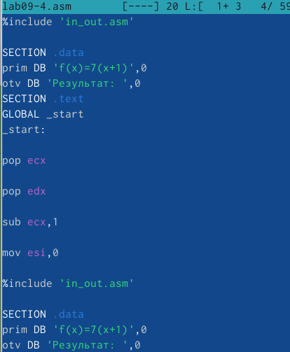

---
## Front matter
title: "Лабораторная работа №9"
subtitle: "Архитектура компьютера"
author: "Казначеева Кристина Никитична"

## Generic otions
lang: ru-RU
toc-title: "Содержание"

## Bibliography
bibliography: bib/cite.bib
csl: pandoc/csl/gost-r-7-0-5-2008-numeric.csl

## Pdf output format
toc: true # Table of contents
toc-depth: 2
fontsize: 12pt
linestretch: 1.5
papersize: a4
documentclass: scrreprt
## I18n polyglossia
polyglossia-lang:
  name: russian
  options:
	- spelling=modern
	- babelshorthands=true
polyglossia-otherlangs:
  name: english
## I18n babel
babel-lang: russian
babel-otherlangs: english
## Fonts
mainfont: IBM Plex Serif
romanfont: IBM Plex Serif
sansfont: IBM Plex Sans
monofont: IBM Plex Mono
mathfont: STIX Two Math
mainfontoptions: Ligatures=Common,Ligatures=TeX,Scale=0.94
romanfontoptions: Ligatures=Common,Ligatures=TeX,Scale=0.94
sansfontoptions: Ligatures=Common,Ligatures=TeX,Scale=MatchLowercase,Scale=0.94
monofontoptions: Scale=MatchLowercase,Scale=0.94,FakeStretch=0.9
mathfontoptions:
## Biblatex
biblatex: true
biblio-style: "gost-numeric"
biblatexoptions:
  - parentracker=true
  - backend=biber
  - hyperref=auto
  - language=auto
  - autolang=other*
  - citestyle=gost-numeric
## Pandoc-crossref LaTeX customization
figureTitle: "Рис."
tableTitle: "Таблица"

## Misc options
indent: true
header-includes:
  - \usepackage{indentfirst}
  - \usepackage{float} # keep figures where there are in the text
  - \floatplacement{figure}{H} # keep figures where there are in the text
---

# Цель работы

Лабораторная работа посвящена практическому освоению программирования с подпрограммами и отладке кода с помощью отладчика GDB.

# Задание

В ходе лабораторной работы мы освоим программирование на NASM с использованием подпрограмм, отладку программ с помощью GDB (включая установку точек останова и работу с данными программы), а также обработку аргументов командной строки. В качестве примеров будут рассмотрены вывод сообщения "Hello, world!" и вычисление заданного выражения.

# Выполнение лабораторной работы

Создадим новый каталог, перейдём в него и создадим файл lab09-1.asm:(рис. [-@fig:001]).

{#fig:001 width=70%}
	
Введём в файл lab9-1.asm текст программы с использованием вызова подпрограммы (рис. [-@fig:002]).

{#fig:002 width=70%}

Создадим исполняемый файл и проверим его работу (рис. [-@fig:003]).

{#fig:003 width=70%}

Затем заменим текст программы, добавив подпрограмму _subcalcul в подпрограмму _calcul,для вычисления выражения f(g(x)), где x вводится с клавиатуры, f(x) = 2x + 7, g(x) = 3x − 1  (рис. [-@fig:004]).
	
{#fig:004 width=70%}

Запустим исполняемый файл и проверим его (рис. [-@fig:005]).

{#fig:005 width=70%}

Создадим файл lab09-2.asm ( (рис. [-@fig:006]).

{#fig:006 width=70%}

Введём в файл lab9-2.asm текст программы вывода сообщения Hello world (рис. [-@fig:007]).

{#fig:007 width=70%}

Для работы с GDB в исполняемый файл добавим отладочную информацию, для этого проведём трансляцию программ необходимо с ключом ‘-g’ (рис. [-@fig:008]):

{#fig:008 width=70%}

Загрузим исполняемый файл в отладчик gdb (рис. [-@fig:009]).

{#fig:009 width=70%}

Проверим работу программы, запустив ее в оболочке GDB с помощью команды run  (рис. [-@fig:010]).

{#fig:010 width=70%}

Для более подробного анализа программы установим брейкпоинт на метку _start, с которой начинается выполнение любой ассемблерной программы (рис. [-@fig:011]).

{#fig:011 width=70%}

Затем запустим программу (рис. [-@fig:012]).

{#fig:012 width=70%}

Посмотрим дисассимилированный код программы с помощью команды disassemble, начиная с метки _start (рис. [-@fig:013]).

{#fig:013 width=70%}

Переключимся на отображение команд с Intel’овским синтаксисом, введя команду set disassembly-flavor intel (рис. [-@fig:014]).

{#fig:014 width=70%}

Включим режим псевдографики для более удобного анализа программы (рис. [-@fig:015]). 

{#fig:015 width=70%} 

Основные различия в отображении синтаксиса машинных команд в режимах ATT (AT&T) и Intel заключаются в следующем:
• Регистры:
  * Intel: Имена регистров пишутся без префикса (например, eax, ebx).
  * ATT: Имена регистров предваряются знаком % (например, %eax, %ebx).
• Операторы размера:
  * Intel: Размер операндов обычно указывается суффиксом (например, mov ax, bx для 16-битных регистров, mov eax, ebx для 32-битных).
  * ATT: Размер операндов обычно указывается префиксом перед именем инструкции (например, movw %bx, %ax для 16-битных, movl %ebx, %eax для 32-битных). Также используются префиксы b (байт), w (слово), l (длинное слово - 32 бита), q (четверное слово - 64 бита).
• Константы:
  * Intel: Константы записываются непосредственно (например, mov eax, 10).
  * ATT: Константы предваряются символом $ (например, movl $10, %eax).
• Метки:
  * Intel: Метки используются непосредственно (например, jmp mylabel).
  * ATT: Метки предваряются знаком . (например, .mylabel).

На предыдущих шагах была установлена точка останова по имени метки (_start). Проверим это с помощью команды info breakpoints (рис. [-@fig:016]).

{#fig:016 width=70%} 

Установим ещё одну точку останова по адресу инструкции (рис. [-@fig:017]).

{#fig:017 width=70%}

Посмотрим информацию о всех установленных точках останова (рис. [-@fig:018]).

{#fig:018 width=70%} 

Выполним 5 инструкций с помощью команды si и проследим за изменением значений регистров (рис. [-@fig:019]).

{#fig:019 width=70%}

Значения регистров eax, ebx, и ecx изменяются (рис. [-@fig:020]).

{#fig:020 width=70%}

Посмотрим содержимое регистров также можно с помощью команды info registers (рис. [-@fig:021]).

{#fig:021 width=70%}

Посмотрим значение переменной msg1 по имени (рис. [-@fig:022]).

{#fig:022 width=70%}

Посмотрим значение переменной msg2 (рис. [-@fig:023]).

{#fig:023 width=70%}

Изменим первоый символ переменной msg1 (рис. [-@fig:024]).

{#fig:024 width=70%}

Заменим любой символ во второй переменной msg2 (рис. [-@fig:025]).

{#fig:025 width=70%}

Чтобы посмотреть значения регистров воспользуемся командой print /F <val> (рис. [-@fig:026]).

{#fig:026 width=70%}

С помощью команды set изменим значение регистра ebx (рис. [-@fig:027]),(рис. [-@fig:028]).

{#fig:027 width=70%}

{#fig:028 width=70%}

Разница в выводе команды p/s $ebx обусловлена тем, как GDB интерпретирует значение, присвоенное регистру $ebx.
• set $ebx='2': Здесь регистру $ebx присваивается строковое значение '2'. Символ ' указывает на строку.
• set $ebx=2: Здесь регистру $ebx присваивается числовое значение 2. Отсутствие кавычек указывает на число. Поэтому p/s $ebx отображает числовое значение 2.
В сущности, в первом случае мы работаем со строкой, а во втором — с целым числом.

Завершим выполнение программы с помощью команды si и выйдем из GDB с помощью команды quit (рис. [-@fig:029]).

{#fig:029 width=70%}

Скопируем файл lab8-2.asm с программой выводящей на экран аргументы командной строки в файл с именем lab09-3.asm:(рис. [-@fig:030]).

{#fig:030 width=70%}

Создадим исполняемый файл (рис. [-@fig:031]).

{#fig:031 width=70%}

Для загрузки в gdb программы с аргументами необходимо использовать ключ --args. Загрузим исполняемый файл в отладчик, указав аргументы (рис. [-@fig:032]).

{#fig:032 width=70%}

Установим точку останова перед первой инструкцией в программе и запустим
ее (рис. [-@fig:033]).

{#fig:033 width=70%}

Адрес вершины стека храниться в регистре esp и по этому адресу располагается число равное количеству аргументов командной строки (включая имя программы). Как видно, число аргументов равно 5 – это имя программы lab09-3 и непосредственно аргументы: аргумент1, аргумент, 2 и 'аргумент 3'(рис. [-@fig:034]).

{#fig:034 width=70%}

Посмотрим остальные позиции стека – по адесу [esp+4] располагается адрес в памяти, где находиться имя программы, по адесу [esp+8] храниться адрес первого аргумента, по аресу [esp+12] – второго и т.д. Смещение на 4 байта происходит потому, что в 64-битной архитектуре указатели (в данном случае, указатели на строки аргументов) занимают 8 байт, и стек выравнивается по 8 байтам (для повышения производительности). Это делает адреса аргументов выровненными по 8 байтам, а смещение между ними равно 8 байтам (рис. [-@fig:035]). 

{#fig:035 width=70%}

Создадим файл lab09-4.asm (рис. [-@fig:036]). 

{#fig:036 width=70%}

Преобразуем программу из лабораторной работы №8 (Задание №1 для самостоятель-
ной работы), реализовав вычисление значения функции f(x)=7(x+1) как подпрограмм (рис. [-@fig:037]). 

{#fig:037 width=70%}

Проверим программу исходного файла(рис. [-@fig:038]). 

{#fig:038 width=70%}

Создадим файл lab09-5.asm (рис. [-@fig:039]). 

{#fig:039 width=70%}

Программа вычисления выражения (3 + 2) ∗ 4 + 5 при запуске дает неверный результат. Проверим это. С помощью отладчика GDB, анализируя изменения значений регистров, определим ошибку и исправим ее (рис. [-@fig:040]). 

{#fig:040 width=70%}

Проверим программу исходного файла (рис. [-@fig:041]). 

{#fig:041 width=70%}

# Вывод

В рамках лабораторной работы были изучены и отработаны навыки программирования на языке ассемблера NASM, включающие создание и использование подпрограмм, отладку программ с помощью отладчика GDB (с применением точек останова и анализа содержимого памяти), а также обработку аргументов командной строки. В качестве иллюстративных примеров были использованы вывод сообщения "Hello, world!" и вычисление математического выражения.
